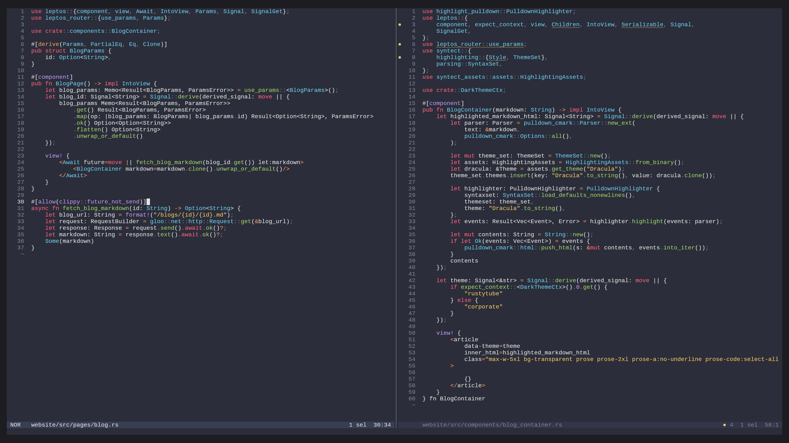

# My Helix Setup for Leptos

<h5>
<div class="flex flex-row gap-6 items-center">
  <div class="flex flex-row gap-2 items-center">
    <svg xmlns="http://www.w3.org/2000/svg" width="32" height="32" fill="currentColor" viewBox="0 0 256 256"><path d="M128,48,68.32,70.38a8,8,0,0,0-5.08,6.17L40,216l139.45-23.24a8,8,0,0,0,6.17-5.08L208,128Zm-4,104a20,20,0,1,1,20-20A20,20,0,0,1,124,152Z" opacity="0.2"></path><path d="M248,92.68a15.86,15.86,0,0,0-4.69-11.31L174.63,12.68a16,16,0,0,0-22.63,0L123.57,41.11l-58,21.77A16.06,16.06,0,0,0,55.35,75.23L32.11,214.68A8,8,0,0,0,40,224a8.4,8.4,0,0,0,1.32-.11l139.44-23.24a16,16,0,0,0,12.35-10.17l21.77-58L243.31,104A15.87,15.87,0,0,0,248,92.68Zm-69.87,92.19L63.32,204l47.37-47.37a28,28,0,1,0-11.32-11.32L52,192.7,71.13,77.86,126,57.29,198.7,130ZM112,132a12,12,0,1,1,12,12A12,12,0,0,1,112,132Zm96-15.32L139.31,48l24-24L232,92.68Z"></path></svg>
    Stephen Power
  </div>
  <div class="flex flex-row gap-2 items-center">
    <svg width="32" height="32" fill="currentColor" viewBox="0 0 256 256">
      <path d="M216,48V88H40V48a8,8,0,0,1,8-8H208A8,8,0,0,1,216,48Z" opacity="0.2"></path>
      <path d="M208,32H184V24a8,8,0,0,0-16,0v8H88V24a8,8,0,0,0-16,0v8H48A16,16,0,0,0,32,48V208a16,16,0,0,0,16,16H208a16,16,0,0,0,16-16V48A16,16,0,0,0,208,32ZM72,48v8a8,8,0,0,0,16,0V48h80v8a8,8,0,0,0,16,0V48h24V80H48V48ZM208,208H48V96H208V208Zm-68-76a12,12,0,1,1-12-12A12,12,0,0,1,140,132Zm44,0a12,12,0,1,1-12-12A12,12,0,0,1,184,132ZM96,172a12,12,0,1,1-12-12A12,12,0,0,1,96,172Zm44,0a12,12,0,1,1-12-12A12,12,0,0,1,140,172Zm44,0a12,12,0,1,1-12-12A12,12,0,0,1,184,172Z"></path>
    </svg>
    2024-08-29
  </div>
</div>
</h5>

Welcome to my first blog post :)

Let's discuss my dev environment using [Helix][helix-site], [dprint][dprint-site], and some language servers.



## Introduction

Here is a table of what I use for my Helix configuration:

|  Language  |                             Lsp                              |                              Formatter                              |
| :--------: | :----------------------------------------------------------: | :-----------------------------------------------------------------: |
|    Rust    |               [`rust-analyzer`][rust-analyzer]               |            [`dprint-plugin-exec (leptosfmt)`][leptosfmt]            |
|    TOML    |                       [`taplo`][taplo]                       |         [`dprint-plugin-toml (taplo)`][dprint-toml-plugin]          |
|    HTML    |    [`vscode-html-language-server`][html-language-server]     |       [`dprint-plugin-exec (tidy-html5)`][dprint-html-plugin]       |
|    CSS     |     [`vscode-css-language-server`][css-language-server]      |          [`dprint-plugin-css (malva)`][dprint-css-plugin]           |
|  Tailwind  | [`tailwindcss-language-server`][tailwindcss-language-server] |                      [`rustywind`][rustywind]                       |
|    JSON    |    [`vscode-json-language-server`][json-language-server]     |      [`dprint-plugin-json (jsonc-parser)`][dprint-json-plugin]      |
| Typescript |  [`typescript-language-server`][typescript-language-server]  |    [`dprint-plugin-typescript (swc)`][dprint-typescript-plugin]     |
|  Markdown  |                    [`marksman`][marksman]                    | [`dprint-plugin-markdown (pulldown-cmark)`][dprint-markdown-plugin] |

## Language Servers

Add [`rust-analyzer`][rust-analyzer], if needed.

```fish
rustup component add rust-analyzer
```

Install [`taplo`][taplo] with [`cargo`][cargo].

```fish
cargo install taplo-cli --features 'lsp'
```

Install [`vscode-langservers-extracted`][vscode-langservers-extracted] using your preferred JS package manager.

```fish
bun install vscode-langservers-extracted
```

Install [`marksman`][marksman], [`taplo`][taplo], [`tailwindcss-language-server`][tailwindcss-language-server], and [`typescript-language-server`][typescript-language-server] with your preferred package manager.

```fish
yay -S marksman taplo tailwindcss-language-server typescript-language-server
```

## Formatting

For my formatting, I use [`dprint`][dprint-github]. See the [installation guide][dprint-installation-guide].

```fish
cargo install dprint
```

### Dprint Plugins

Let's install the necessary dprint plugins.

```fish
dprint config add toml && \
dprint config add json && \
dprint config add typescript && \
dprint config add markdown && \
dprint config add g-plane/malva && \
dprint config add g-plane/markup_fmt
```

### Leptos Formatting

To format our Leptos `view!` blocks and Rust code, let's install [`leptosfmt`][leptosfmt] using [`cargo`][cargo].

```fish
cargo install leptosfmt
```

#### Configuration of non-dprint formatters

To add non-dprint formatters, we need to define them as commands in `dprint.json` or `.dprint.json`.

```js
{
  "exec": {
    "commands": [{
      "command": "leptosfmt --stdin --rustfmt -q -e",
      "exts": ["rs"]
    }]
  }
}
```

Note: Appending `-e` to Leptosfmt, will add experimental support for Tailwind class formatting using [`rustywind`][rustywind].

IMPORTANT: For any formatters added using the [`dprint-plugin-exec`][dprint-exec-plugin] method, the helix formatter command must be: `dprint fmt --stdin {extension}` where the extension is equal to the one defined in `dprint.json` or `.dprint.json`.

## Configuring Helix

We have all of our formatters and language servers ready.

Now, let's add them to our Helix config at `$HOME/.config/helix/languages.toml`.

```toml
[[language]]
name = "rust"
scope = "source.rust"
injection-regex = "rust"
file-types = ["rs"]
roots = ["Cargo.toml", "Cargo.lock", "tailwind.config.js"]
formatter = { command = "dprint", args = ["fmt", "--stdin", "rs"] }
language-servers = ["rust-analyzer", "tailwindcss-language-server"]
auto-format = true

[language-server.rust-analyzer.config]
cargo = { features = "all" }
check.command = "clippy"
except-features = ["format"]

[language-server.tailwindcss-language-server]
command = "tailwindcss-language-server"
config = { userLanguages = { rust = "html", "*.rs" = "html", "*.html" = "html" } }
args = ["--stdio"]
except-features = ["format"]

[language-server.vscode-html-language-server]
command = "vscode-html-language-server"
args = ["--stdio"]

[language-server.vscode-css-language-server]
command = "vscode-css-language-server"
args = ["--stdio"]

[language-server.vscode-json-language-server]
command = "vscode-json-language-server"
args = ["--stdio"]

[[language]]
name = "html"
file-types = ["html"]
language-servers = [
  "vscode-html-language-server",
  "tailwindcss-language-server",
]
formatter = { command = "dprint", args = ["fmt", "--stdin", "html"] }
auto-format = true

[[language]]
name = "css"
file-types = ["css"]
language-servers = ["vscode-css-language-server", "tailwindcss-language-server"]
formatter = { command = "dprint", args = ["fmt", "--stdin", "css"] }
auto-format = true

[[language]]
name = "json"
file-types = ["json"]
language-servers = ["vscode-json-language-server"]
formatter = { command = "dprint", args = ["fmt", "--stdin", "json"] }
auto-format = true

[[language]]
name = "javascript"
file-types = ["js", "jsx"]
language-servers = ["typescript-language-server"]
formatter = { command = "dprint", args = ["fmt", "--stdin", "js"] }
auto-format = true

[[language]]
name = "typescript"
file-types = ["js", "jsx"]
language-servers = ["typescript-language-server"]
formatter = { command = "dprint", args = ["fmt", "--stdin", "ts"] }
auto-format = true

[[language]]
name = "jsx"
language-servers = ["typescript-language-server"]
formatter = { command = "dprint", args = ["fmt", "--stdin", "jsx"] }
auto-format = true

[[language]]
name = "tsx"
language-servers = ["typescript-language-server"]
formatter = { command = "dprint", args = ["fmt", "--stdin", "tsx"] }
auto-format = true

[[language]]
name = "markdown"
file-types = ["md"]
language-servers = ["marksman"]
formatter = { command = "dprint", args = ["fmt", "--stdin", "md"] }
auto-format = true

[[language]]
name = "toml"
file-types = ["toml"]
language-servers = ["taplo"]
formatter = { command = "dprint", args = ["fmt", "--stdin", "toml"] }
auto-format = true
```

## Helix Customisation

This section is based on my personal preferences and is completely optional.

### Theming

I am a big fan of [CptPotato's Helix themes][cptpotato-themes].

Install them with this script.

```fish
git clone https://github.com/CptPotato/helix-themes && \
cd helix-themes && \
chmod +x build.sh && \
./build.sh && \
cp build/* $HOME/.config/helix/themes/
```

You can preview all of your themes in Helix by typing `:theme` in Normal mode.

Personally, `sonokai_andromeda` is the best.

You can set your theme permanently in `$HOME/.config/helix/config.toml`.

```
theme = "sonokai_andromeda"
```

## Fonts

My current programming font of choice is [`Cousine`][cousine].

Fonts must be configured with your terminal, not Helix itself.

I use [kitty][kitty], so let's configure that in `$HOME/config/kitty/kitty.conf`.

```
font_family      Cousine Nerd Font Mono Regular
bold_font        Cousine Nerd Font Mono Medium
italic_font      Cousine Nerd Font Mono Italic
bold_italic_font Cousine Nerd Font Mono Medium Italic

font_size 12.0
```

## Conclusion

This has been my entire development environment with Helix, dprint and lsps.

This was mainly used for Leptos development, especially during the development of [RustyTube][rustytube].

### Toss a coin...

#### Liberapay

<a class="no-prose" href="https://liberapay.com/opensourcecheemsburgers/donate"></a>

#### Bitcoin

```txt
bc1q8r90zc8j8a2rvkq4ds8374pxh3rpccxgnjx5x2
```

#### Monero

```txt
42bhoxB2DT125WAxLHHZAm2jUpEWUJBe1HAKtmiZsjW6X2r3z8FBqQFEhZdkywuQrrKfnehhhaJexQjVKpahBooq3zYKNjf
```

[helix-site]: https://helix-editor.com/
[cargo]: https://doc.rust-lang.org/cargo/
[dprint-github]: https://github.com/dprint/dprint
[dprint-site]: https://dprint.dev/
[dprint-installation-guide]: https://dprint.dev/install
[dprint-site-plugins]: https://dprint.dev/plugins
[rust-analyzer]: https://github.com/rust-lang/rust-analyzer
[taplo]: https://github.com/tamasfe/taplo
[tailwindcss-language-server]: https://github.com/tailwindlabs/tailwindcss-intellisense/tree/HEAD/packages/tailwindcss-language-server
[vscode-langservers-extracted]: https://github.com/hrsh7th/vscode-langservers-extracted
[html-language-server]: https://github.com/microsoft/vscode-html-languageservice
[css-language-server]: https://github.com/microsoft/vscode-css-languageservice
[json-language-server]: https://github.com/microsoft/vscode-json-languageservice
[typescript-language-server]: https://github.com/typescript-language-server/typescript-language-server
[marksman]: https://github.com/artempyanykh/marksman
[leptosfmt]: https://github.com/bram209/leptosfmt
[dprint-toml-plugin]: https://github.com/dprint/dprint-plugin-toml
[dprint-html-plugin]: https://github.com/g-plane/markup_fmt
[dprint-css-plugin]: https://github.com/g-plane/malva
[dprint-json-plugin]: https://github.com/dprint/dprint-plugin-json
[dprint-typescript-plugin]: https://github.com/dprint/dprint-plugin-typescript
[dprint-markdown-plugin]: https://github.com/dprint/dprint-plugin-markdown
[dprint-exec-plugin]: https://github.com/dprint/dprint-plugin-markdown
[rustywind]: https://github.com/avencera/rustywind
[cptpotato-themes]: https://github.com/CptPotato/helix-themes
[kitty]: https://github.com/kovidgoyal/kitty
[cousine]: https://www.programmingfonts.org/#cousine
[rustytube]: https://github.com/opensourcecheemsburgers/RustyTube

<!-- ```toml -->
<!-- [[language]] -->
<!-- name = "rust" -->
<!-- scope = "source.rust" -->
<!-- injection-regex = "rust" -->
<!-- file-types = ["rs"] -->
<!-- roots = ["Cargo.toml", "Cargo.lock", "tailwind.config.js"] -->
<!-- formatter = { command = "dprint", args = ["fmt", "--stdin", "rs"] } -->
<!-- language-servers = ["rust-analyzer", "tailwindcss-language-server"] -->
<!-- auto-format = true -->

<!-- [language-server.rust-analyzer.config] -->
<!-- cargo = { features = "all" } -->
<!-- check.command = "clippy" -->
<!-- except-features = ["format"] -->

<!-- [language-server.tailwindcss-language-server] -->
<!-- command = "tailwindcss-language-server" -->
<!-- config = { userLanguages = { rust = "html", "*.rs" = "html", "*.html" = "html" } } -->
<!-- args = ["--stdio"] -->
<!-- except-features = ["format"] -->

<!-- [language-server.vscode-html-language-server] -->
<!-- command = "vscode-html-language-server" -->
<!-- args = ["--stdio"] -->

<!-- [language-server.vscode-css-language-server] -->
<!-- command = "vscode-css-language-server" -->
<!-- args = ["--stdio"] -->

<!-- [language-server.vscode-json-language-server] -->
<!-- command = "vscode-json-language-server" -->
<!-- args = ["--stdio"] -->

<!-- [[language]] -->
<!-- name = "html" -->
<!-- file-types = ["html"] -->
<!-- language-servers = [ -->
<!-- "vscode-html-language-server", -->
<!-- "tailwindcss-language-server", -->
<!-- ] -->
<!-- formatter = { command = "dprint", args = ["fmt", "--stdin", "html"] } -->
<!-- auto-format = true -->

<!-- [[language]] -->
<!-- name = "css" -->
<!-- file-types = ["css"] -->
<!-- language-servers = ["vscode-css-language-server", "tailwindcss-language-server"] -->
<!-- formatter = { command = "dprint", args = ["fmt", "--stdin", "css"] } -->
<!-- auto-format = true -->

<!-- [[language]] -->
<!-- name = "markdown" -->
<!-- file-types = ["md"] -->
<!-- language-servers = ["marksman"] -->
<!-- formatter = { command = "dprint", args = ["fmt", "--stdin", "md"] } -->
<!-- auto-format = true -->

<!-- [[language]] -->
<!-- name = "toml" -->
<!-- file-types = ["toml"] -->
<!-- language-servers = ["taplo"] -->
<!-- formatter = { command = "dprint", args = ["fmt", "--stdin", "toml"] } -->
<!-- auto-format = true -->

<!-- [[language]] -->
<!-- name = "javascript" -->
<!-- file-types = ["js", "jsx"] -->
<!-- language-servers = ["typescript-language-server"] -->
<!-- formatter = { command = "dprint", args = ["fmt", "--stdin", "js"] } -->
<!-- auto-format = true -->

<!-- [[language]] -->
<!-- name = "typescript" -->
<!-- file-types = ["js", "jsx"] -->
<!-- language-servers = ["typescript-language-server"] -->
<!-- formatter = { command = "dprint", args = ["fmt", "--stdin", "ts"] } -->
<!-- auto-format = true -->

<!-- [[language]] -->
<!-- name = "jsx" -->
<!-- language-servers = ["typescript-language-server"] -->
<!-- formatter = { command = "dprint", args = ["fmt", "--stdin", "jsx"] } -->
<!-- auto-format = true -->

<!-- [[language]] -->
<!-- name = "tsx" -->
<!-- language-servers = ["typescript-language-server", "eslint", "emmet-ls"] -->
<!-- formatter = { command = "dprint", args = ["fmt", "--stdin", "tsx"] } -->
<!-- auto-format = true -->

<!-- [[language]] -->
<!-- name = "json" -->
<!-- file-types = ["json"] -->
<!-- language-servers = ["vscode-json-language-server"] -->
<!-- formatter = { command = "dprint", args = ["fmt", "--stdin", "json"] } -->
<!-- auto-format = true -->
<!-- ``` -->
